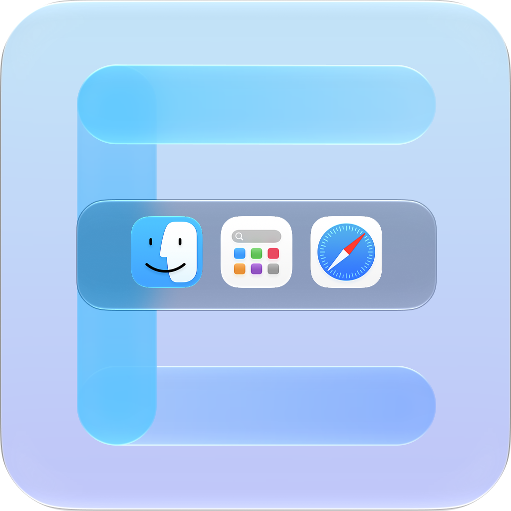

<div align="center">

<div style="display: inline-block; overflow: hidden; border-radius: 24px; line-height: 0;">
  
</div>

<h1>EchoDock</h1>

<p>
  <strong>让每一块屏幕，都有一个熟悉的程序坞。</strong><br>
  <strong>A familiar Dock on every display.</strong>
</p>

<p>
  一款为多显示器 Mac 打造的轻量级菜单栏工具。<br>
  A lightweight menu bar utility built for multi-display Macs.
</p>

<p>
  
  
</p>

<p><a href="#中文">中文</a> · <a href="#english">English</a></p>

</div>

---

## 中文

### EchoDock 是什么？

macOS 在多个显示器之间仍然只有一个原生 Dock。想打开当前屏幕上的应用时，你往往需要先把鼠标移动到 Dock 所在的屏幕，或者等待原生 Dock 被系统迁移过来。

EchoDock 在你选择的显示器底部提供独立、可交互的程序坞。它会单向读取系统 Dock 中固定的应用与排列顺序，并通过系统工作区同步当前应用的运行状态，让你无需跨屏寻找原生 Dock，也能在当前屏幕启动、切换和管理应用。

> EchoDock 是原生 Dock 的多屏伴侣，不会复制、注入、替换或重启 `Dock.app`，也不会改写系统 Dock 的应用列表。

### 主要功能

| 功能 | 说明 |
| --- | --- |
| 多屏程序坞 | 为每块在线、非镜像从属显示器独立启用或关闭 EchoDock，并响应显示器连接、断开和重新排列。 |
| 单向同步系统 Dock | 自动读取系统 Dock 的固定应用与顺序，并从本机应用包加载本地化名称和图标；系统 Dock 发生增删或排序后会自动刷新，读取失败时使用上一次有效列表。 |
| 运行中的应用 | 可在分隔线后显示“正在运行但未固定”的普通应用；所有已启用屏幕共享同一应用列表。 |
| 原生感交互 | 支持可选的底部热区与自动隐藏、完整应用名称提示、连续范围放大、相邻图标位移、Dock 宽度伸缩和横向滚动。 |
| 动画反馈 | 可选的应用启动弹跳与运行指示灯；未固定的运行中应用进入或退出时平滑缩放和渐显、渐隐。 |
| 应用操作 | 左键启动或切换应用；右键可打开应用、显示窗口、关闭窗口、隐藏/显示、退出，以及在 Finder 中定位。 |
| 外观调整 | 调整图标大小、图标间距、背景透明度、放大倍率、影响范围和名称框距离，并独立开关启动弹跳与运行指示灯；macOS 26 及以上可切换经典与液态玻璃风格。 |
| 原生 Dock 屏幕策略 | 显示原生 Dock 的实际所在屏幕，或尝试将它固定到所选显示器；状态会在设置中明确展示。 |
| 菜单栏控制 | 快速显示/隐藏 EchoDock、立即刷新应用列表、打开设置与关于窗口，或退出应用。 |

### 快速开始

1. 打开 `EchoDock.app`。EchoDock 会常驻菜单栏，不会占用系统 Dock 的位置。
2. 点击菜单栏中的 EchoDock 图标，选择“设置…”。
3. 打开“显示器”页面，为需要使用 EchoDock 的屏幕勾选 EchoDock。
4. EchoDock 默认常驻在已启用屏幕的底部；如需鼠标触边时才显示，可在“通用”中开启“自动隐藏”。
5. 左键点击图标启动或切换应用；右键点击图标使用更多操作。

默认情况下，EchoDock 会启用所有可用屏幕、保持显示，并显示运行中但未固定的应用；启动弹跳与运行指示灯也默认开启。你可以在“通用”中自行开启自动隐藏，或从菜单栏选择“隐藏 EchoDock”，临时隐藏所有面板而不退出后台同步。

### 使用方式

#### 启动与切换应用

- 点击尚未运行的应用，EchoDock 会启动它；“启动弹跳”开启时会播放一次完整的弹跳动画。
- 点击正在运行的应用，EchoDock 会取消隐藏该应用并将它切换到前台。
- “运行指示灯”开启时，图标下方的指示点表示应用正在运行。
- 应用列表过宽时，可在 EchoDock 上使用触控板或鼠标滚轮横向浏览。

#### 悬停放大与名称提示

- 鼠标在图标之间移动时，指针附近的一组图标会连续放大并产生轻微位移，Dock 会随之平滑伸缩。
- 名称框显示应用的完整本地化名称，并跟随当前悬停图标。
- 指针离开图标后，名称框会以稍长且平滑的渐隐收尾，不会突兀消失或残留。
- 可在“设置 → 外观”关闭放大效果，或调整放大倍率、影响范围与名称框距离。
- 开启 macOS 的“减少动态效果”“降低透明度”或“增强对比度”后，EchoDock 会采用相应的辅助显示行为。

#### 右键菜单

| 状态 | 可用操作 |
| --- | --- |
| 应用未运行 | 在 Finder 中显示、打开。 |
| 应用正在运行 | 在 Finder 中显示、显示所有窗口、关闭窗口、隐藏/显示、退出。 |
| Finder | 提供窗口与隐藏/显示操作，但不提供“退出”。 |

“显示所有窗口”会激活该应用及其窗口，并不等同于原生 Dock 的 App Exposé。“关闭窗口”只关闭一个当前可关闭的窗口，不会向应用发送退出或强制退出命令。

### 设置指南

#### 通用

| 设置 | 作用 | 范围 / 默认值 |
| --- | --- | --- |
| 启用 EchoDock | 显示或隐藏所有 EchoDock 面板，菜单栏工具仍会继续运行。 | 默认开启 |
| 自动隐藏 | 鼠标离开后自动收起；关闭后保持显示。 | 默认关闭 |
| 显示运行中未固定应用 | 将未固定但正在运行的普通应用放在分隔线后。 | 默认开启 |
| 自动启用新连接显示器 | 新显示器首次连接时自动为其创建 EchoDock。 | 默认开启 |
| 自动收起延迟 | 鼠标离开后等待多久再隐藏。 | `0.2–2.0 秒`，默认 `0.6 秒` |
| 内部屏幕边缘停留 | 在上下相邻的屏幕边界处，停留多久才唤出 EchoDock，减少跨屏时误触。 | `0–0.5 秒`，默认 `0.2 秒` |
| 登录时启动 | 登录 macOS 后自动启动 EchoDock。 | 默认关闭 |
| 辅助功能权限 | 申请或查看辅助功能授权状态。 | 按需授权 |

#### 外观

| 设置 | 范围 / 默认值 | 说明 |
| --- | --- | --- |
| 图标大小 | `32–64 pt`，默认 `48 pt` | 连续调节应用图标的基础尺寸。 |
| 图标间距 | `4–28 pt`，默认 `5.2 pt` | 调节相邻图标之间的距离。 |
| 背景透明度 | `0–100%`，默认 `17%` | 数值越大越透明；`0%` 最不透明，`100%` 时背景完全不可见，图标仍保持可见和可交互。 |
| 背景风格 | 经典 / 液态玻璃 | 仅 macOS 26 及以上显示；macOS 13–25 保持经典材质。 |
| 图标放大 | 开 / 关，默认开启 | 控制悬停时是否启用范围放大。 |
| 启动弹跳 | 开 / 关，默认开启 | 控制应用开始启动时是否播放完整弹跳反馈。 |
| 运行指示灯 | 开 / 关，默认开启 | 控制是否在运行中的应用图标下方显示指示点。 |
| 放大倍率 | `1.10–1.80 倍`，默认 `1.18 倍` | 控制指针中心附近图标的最大尺寸。 |
| 影响范围 | `1.25–3.50 个图标槽`，默认 `3.0` | 控制放大效果向左右影响多少相邻图标。 |
| 名称框距离 | `0–24 pt`，默认 `4 pt` | 调节应用名称框与 EchoDock 的垂直距离。 |

> macOS 的“降低透明度”和“增强对比度”设置优先级更高，可能覆盖背景透明度或材质表现。

#### 显示器

“显示器”页面分别管理两件事：

1. **原生 Dock 在哪里：** 由 macOS 自行管理，或尝试固定在一块所选显示器上。
2. **EchoDock 在哪里：** 每块在线、非镜像从属显示器都可单独启用或关闭。

显示器示意图和列表会区分原生 Dock 的实际位置，以及 EchoDock 当前启用的屏幕；固定模式的目标与运行状态会显示在页面状态文案中。镜像模式中的从属屏幕与主镜像屏共享画面，因此不能单独承载一个 EchoDock。

### 辅助功能权限

基本的多屏显示、Dock 列表同步、启动/切换应用、隐藏应用和退出应用都不需要辅助功能权限，也不需要屏幕录制或自动化权限。

以下功能需要辅助功能权限：

- 检测原生 Dock 当前实际位于哪块显示器；
- 尝试迁移并固定原生 Dock；
- 通过右键菜单关闭其他应用的窗口。

前往“设置 → 通用 → 辅助功能权限”，点击“申请辅助功能权限”，再在“系统设置 → 隐私与安全性 → 辅助功能”中允许 EchoDock。授权后重新打开设置页或右键菜单，状态会自动更新。

“关闭窗口”只有在 EchoDock 已获得辅助功能权限，且目标应用确实存在可关闭窗口时才会启用。未授权时，该选项会置灰并显示“需要辅助功能权限”。

### 管理原生 Dock 所在屏幕

#### 由 macOS 管理

这是默认且最稳妥的模式。EchoDock 不迁移原生 Dock；macOS 仍可根据触边行为决定它出现在哪块屏幕。授予辅助功能权限后，EchoDock 会读取并显示原生 Dock 的实际位置；无法读取时会明确显示“无法检测”，不会用主显示器或上一次选择代替真实结果。

#### 固定在所选显示器

EchoDock 会尝试把原生 Dock 引导到目标显示器，并阻止其他屏幕上对应的 Dock 边缘再次触发它。选择目标后，EchoDock 默认在目标屏幕关闭自身、在其余屏幕启用；你仍可手动让两个 Dock 同屏，但应用会提示可能发生重叠。

使用该模式前请注意：

- Apple 没有提供公开的“永久绑定 Dock 到显示器”API，因此这是 **best-effort** 行为，不能保证在所有环境下永久生效。
- 固定到非主显示器时，需要在“系统设置 → 桌面与程序坞 → 调度中心”开启“显示器具有单独的空间”，并按 macOS 提示重新登录。
- EchoDock 不会修改主显示器、菜单栏、显示器排列、分辨率、缩放，也不会修改系统 Dock 的大小、屏幕边缘位置（左侧、底部或右侧）、自动隐藏或应用列表。
- 特殊输入设备、显示器排列、全屏应用或 macOS 更新可能影响迁移与保护效果；出现异常时可切回“由 macOS 管理”。

### 隐私

- 不需要账号，不包含遥测，也不主动联网。
- 不采集用户内容、操作记录或屏幕图像。
- 系统 Dock 列表、应用运行状态、显示器信息、偏好设置和最后一次有效缓存均只在本机读取或保存。
- 获得辅助功能权限后，只读取实现上述功能所需的 Dock 几何信息和窗口状态，不读取文稿内容。

### 当前边界

EchoDock 当前专注于“在多个屏幕快速启动和切换应用”，并非原生 Dock 的完整替代品。目前不提供：

- 在 EchoDock 内固定、取消固定或重新排列应用；请在系统 Dock 中操作，EchoDock 会单向同步结果；
- 通知角标、下载进度、第三方自定义 Dock Tile；
- 文件夹、废纸篓、最近使用项目、最小化窗口与窗口缩略图；
- 每块显示器使用不同的应用列表；
- 左侧、右侧或顶部布局；
- 原生 App Exposé；
- 正式签名与公证安装包、自动更新。

当前界面为简体中文。双屏、三屏、全屏、睡眠恢复、显示器热插拔和权限撤销等组合场景仍需在对应的真实硬件环境中验证。

### 常见问题

<details>
<summary><strong>EchoDock 没有出现</strong></summary>

确认菜单栏中显示的是“隐藏 EchoDock”，而不是“显示 EchoDock”；然后检查“设置 → 显示器”中是否已为当前屏幕启用 EchoDock。自动隐藏开启时，请把鼠标停在屏幕底部中央区域。如果该位置属于内部屏幕边缘，还需要等待设定的停留时间。

</details>

<details>
<summary><strong>系统 Dock 更新后，EchoDock 列表没有变化</strong></summary>

点击菜单栏图标并选择“立即刷新”。如果系统 Dock 配置暂时无法读取，EchoDock 会继续使用上一次有效列表，并在菜单栏显示缓存状态。

</details>

<details>
<summary><strong>“关闭窗口”为什么是灰色？</strong></summary>

目标应用可能没有可关闭窗口，或 EchoDock 尚未获得辅助功能权限。前往“设置 → 通用”检查权限，授权后重新打开右键菜单。

</details>

<details>
<summary><strong>为什么原生 Dock 的实际屏幕显示“无法检测”？</strong></summary>

检测真实位置需要辅助功能权限。授权后重新打开“显示器”页面；如果仍无法检测，原生 Dock 可能处于隐藏、全屏切换或系统暂时不可读状态，稍后可点击“立即刷新”。

</details>

<details>
<summary><strong>为什么无法把原生 Dock 固定到非主显示器？</strong></summary>

确认已授予辅助功能权限，并在 macOS 中开启“显示器具有单独的空间”。这个系统选项变更后通常需要退出登录并重新登录。

</details>

<details>
<summary><strong>EchoDock 会覆盖其他应用的窗口吗？</strong></summary>

EchoDock 是浮层，不会为其他窗口预留桌面工作区。关闭自动隐藏后，它会持续显示在屏幕底部；如有遮挡，请重新开启自动隐藏或关闭该屏幕的 EchoDock。

</details>

---

## English

### What is EchoDock?

macOS still provides only one system Dock across multiple displays. To open an app from the display you are using, you may first need to move the pointer to the display that currently owns the Dock or wait for macOS to move it there.

EchoDock adds an independent, interactive app dock to the bottom of each display you select. It reads pinned apps and their order from the system Dock in one direction, then tracks current app state through the system workspace, so you can launch, switch, and manage apps without chasing the Dock across your workspace.

> EchoDock is a multi-display companion to the system Dock. It does not copy, inject into, replace, or restart `Dock.app`, and it does not rewrite the system Dock's app list.

### Highlights

| Feature | What it does |
| --- | --- |
| A Dock on every display | Enable or disable EchoDock independently on each online display that is not a secondary mirror. Display connections, disconnections, and rearrangements are detected automatically. |
| One-way system Dock sync | Reads pinned apps and order from the system Dock, then loads localized names and icons from local app bundles. Changes are refreshed automatically, with the last valid list used as a fallback when the preferences are temporarily unavailable. |
| Running apps | Optionally shows regular apps that are running but not pinned, separated from pinned apps by a divider. Every enabled display shares the same list. |
| Native-feeling interaction | Includes optional bottom-edge reveal and auto-hide, full app-name labels, continuous neighborhood magnification, icon displacement, Dock width expansion, and horizontal scrolling. |
| Motion feedback | Offers optional launch bounces and running indicators, and smoothly scales/fades unpinned running apps in and out. |
| App controls | Left-click to launch or switch. Right-click to open, reveal windows, close a window, hide/show, quit, or locate the app in Finder. |
| Appearance controls | Adjust icon size, spacing, background transparency, magnification scale and range, and label distance, with separate launch-bounce and running-indicator switches. macOS 26 and later can switch between Classic and Liquid Glass. |
| System Dock display policy | Shows the display that actually contains the system Dock, or makes a best-effort attempt to keep it on a selected display. |
| Menu bar controls | Show/hide EchoDock, refresh the app list, open Settings or About, and quit the utility. |

### Quick start

1. Open `EchoDock.app`. EchoDock stays in the menu bar and does not add itself to the system Dock.
2. Click the EchoDock menu bar icon and choose “Settings”.
3. Open the “Displays” page and enable EchoDock for the displays where you want to use it.
4. EchoDock stays visible at the bottom of enabled displays by default. To reveal it only at the screen edge, turn on “Auto Hide” under General.
5. Left-click an icon to launch or switch apps. Right-click for additional actions.

By default, EchoDock is enabled on every available display, stays visible, and includes running apps that are not pinned. Launch bounces and running indicators are also enabled by default. You can turn on Auto Hide under General, or choose “Hide EchoDock” from the menu bar to hide all panels temporarily while keeping synchronization running.

### How to use it

#### Launching and switching apps

- Click an app that is not running to launch it. When Launch Bounce is enabled, EchoDock plays one complete bounce sequence.
- Click a running app to unhide it and bring it forward.
- When Running Indicators is enabled, the indicator below an icon means the app is currently running.
- If the app list is wider than the display, use a trackpad or mouse wheel over EchoDock to scroll horizontally.

#### Magnification and app-name labels

- As the pointer moves between icons, a neighborhood of nearby icons continuously magnifies and shifts while the Dock smoothly changes width.
- The label shows the app's full localized display name and follows the currently hovered icon.
- After the pointer leaves an icon, the label finishes with a slightly longer, smooth fade instead of disappearing abruptly or lingering.
- Open Settings → Appearance to disable magnification or adjust its scale, influence range, and label distance.
- EchoDock responds to the macOS Reduce Motion, Reduce Transparency, and Increase Contrast accessibility settings.

#### Context menu

| App state | Available actions |
| --- | --- |
| Not running | Show in Finder, Open. |
| Running | Show in Finder, Show All Windows, Close Window, Hide/Show, Quit. |
| Finder | Window and Hide/Show actions are available, but Quit is intentionally omitted. |

“Show All Windows” activates the app and its windows; it is not the system Dock's App Exposé. “Close Window” presses the close control of one eligible window. It does not send Quit or Force Quit to the app.

### Settings reference

#### General

| Setting | Purpose | Range / default |
| --- | --- | --- |
| Enable EchoDock | Shows or hides all EchoDock panels while the menu bar utility keeps running. | On by default |
| Auto Hide | Hides the Dock after the pointer leaves; turn it off to keep the Dock visible. | Off by default |
| Show unpinned running apps | Places regular running apps that are not pinned after the divider. | On by default |
| Enable newly connected displays | Creates an EchoDock on a display the first time it is connected. | On by default |
| Hide delay | Controls how long EchoDock waits after the pointer leaves. | `0.2–2.0 s`, default `0.6 s` |
| Internal-edge dwell | Delays reveal on an edge shared by vertically adjacent displays to prevent accidental triggers while crossing screens. | `0–0.5 s`, default `0.2 s` |
| Launch at login | Starts EchoDock after you sign in to macOS. | Off by default |
| Accessibility permission | Requests permission or shows its current status. | Granted only when needed |

#### Appearance

| Setting | Range / default | Purpose |
| --- | --- | --- |
| Icon size | `32–64 pt`, default `48 pt` | Continuously adjusts the base icon size. |
| Icon spacing | `4–28 pt`, default `5.2 pt` | Changes the horizontal distance between adjacent icons. |
| Background transparency | `0–100%`, default `17%` | Higher values are more transparent. `0%` is least transparent; at `100%` the background is invisible while icons stay visible and interactive. |
| Background style | Classic / Liquid Glass | Available on macOS 26 and later. macOS 13–25 retain the Classic material. |
| Icon magnification | On / Off, on by default | Enables neighborhood magnification while hovering. |
| Launch Bounce | On / Off, on by default | Controls whether a complete bounce plays when an app begins launching. |
| Running Indicators | On / Off, on by default | Controls whether running apps show an indicator below their icons. |
| Magnification scale | `1.10–1.80×`, default `1.18×` | Sets the maximum icon size near the pointer center. |
| Influence range | `1.25–3.50 icon slots`, default `3.0` | Controls how many neighboring icons are affected on either side. |
| Label distance | `0–24 pt`, default `4 pt` | Sets the vertical gap between the app-name label and EchoDock. |

> macOS Reduce Transparency and Increase Contrast take precedence and may override the selected transparency or material appearance.

#### Displays

The Displays page manages two separate decisions:

1. **Where the system Dock goes:** let macOS manage it, or make a best-effort attempt to keep it on one selected display.
2. **Where EchoDock appears:** enable or disable EchoDock independently on each online display that is not a secondary mirror.

The display map and list distinguish the system Dock's detected location from the displays where EchoDock is enabled. The selected target and current fixed-mode status are reported in the page's status text. A secondary display in mirror mode shares the same image as its primary mirror and cannot host a separate EchoDock.

### Accessibility permission

The core multi-display Dock, app-list synchronization, launching/switching, hiding, and quitting do not require Accessibility permission. EchoDock does not require Screen Recording or Automation permission.

Accessibility permission is required to:

- detect which display actually contains the system Dock;
- relocate and protect the system Dock in fixed mode;
- close another app's window from the context menu.

Open Settings → General → Accessibility Permission, click “Request Accessibility Permission”, then allow EchoDock under System Settings → Privacy & Security → Accessibility. Reopen the Settings page or context menu after granting permission; the status updates automatically.

“Close Window” is enabled only when EchoDock has Accessibility permission and the target app has an eligible window. Without permission, the item is disabled and displays “Accessibility Permission Required”.

### Choosing a display for the system Dock

#### Managed by macOS

This is the default and most reliable mode. EchoDock does not move the system Dock, and macOS remains free to show it on another display in response to edge gestures. With Accessibility permission, EchoDock reports the Dock's detected location. If detection fails, the UI reports it as unknown instead of substituting the primary display or a previous target.

#### Fixed to a selected display

EchoDock attempts to guide the system Dock to the target display and prevent the corresponding Dock edge on other displays from moving it again. When a target is first selected, EchoDock is disabled on that display and enabled on the others by default. You can still enable both Docks on one display, but EchoDock will warn that they may overlap.

Before using this mode, note that:

- Apple does not provide a public API for permanently binding the Dock to a display. This is a **best-effort** feature and cannot be guaranteed in every environment.
- To target a non-primary display, enable “Displays have separate Spaces” under System Settings → Desktop & Dock → Mission Control, then sign out and back in when macOS asks.
- EchoDock does not change the primary display, menu bar, display arrangement, resolution, scaling, or any system Dock size, screen-edge position (left, bottom, or right), auto-hide, or app-list preference.
- Unusual input devices, display arrangements, full-screen apps, or macOS updates may affect relocation and protection. Switch back to “Managed by macOS” if the behavior becomes unreliable.

### Privacy

- No account is required. EchoDock contains no telemetry and does not initiate network connections.
- It does not collect user content, interaction history, or screen images.
- The system Dock list, app state, display information, preferences, and last valid cache are read or stored locally only.
- With Accessibility permission, EchoDock reads only the Dock geometry and window state needed for the features above, not document contents.

### Current limitations

EchoDock currently focuses on fast app launching and switching across displays. It is not a full replacement for the system Dock. It does not currently provide:

- pinning, unpinning, or reordering inside EchoDock; make those changes in the system Dock and EchoDock will sync them one way;
- notification badges, download progress, or custom third-party Dock Tiles;
- folders, Trash, recent items, minimized windows, or window thumbnails;
- a different app list for each display;
- left, right, or top-edge layouts;
- native App Exposé;
- a signed/notarized distribution package or automatic updates.

The current application UI is in Simplified Chinese. Dual-display, triple-display, full-screen, sleep/wake, hot-plug, and permission-revocation combinations still require validation on the corresponding physical hardware.

### Troubleshooting

<details>
<summary><strong>EchoDock does not appear</strong></summary>

The menu bar should offer “Hide EchoDock”, not “Show EchoDock”. Then check that the current display is enabled under Settings → Displays. With Auto Hide enabled, keep the pointer at the bottom-center area. A shared internal display edge may also require the configured dwell time.

</details>

<details>
<summary><strong>The app list did not change after editing the system Dock</strong></summary>

Choose “Refresh Now” from the menu bar. If the system Dock preferences are temporarily unavailable, EchoDock keeps using the last valid list and reports the cached state in the menu.

</details>

<details>
<summary><strong>Why is “Close Window” disabled?</strong></summary>

The target app may have no eligible window, or EchoDock may not have Accessibility permission. Check the permission under Settings → General, then reopen the context menu after granting it.

</details>

<details>
<summary><strong>Why is the system Dock's display reported as unknown?</strong></summary>

Detecting the real location requires Accessibility permission. Grant it and reopen the Displays page. If detection still fails, the system Dock may be hidden, transitioning into or out of full screen, or temporarily unavailable; try Refresh Now after the transition finishes.

</details>

<details>
<summary><strong>Why can I not fix the system Dock to a non-primary display?</strong></summary>

Confirm that Accessibility permission is granted and “Displays have separate Spaces” is enabled in macOS. Changing that system option normally requires signing out and signing back in.

</details>

<details>
<summary><strong>Can EchoDock cover other app windows?</strong></summary>

EchoDock is an overlay and does not reserve desktop work area for other windows. With Auto Hide turned off, it remains visible at the bottom. Turn Auto Hide back on or disable EchoDock on that display if it gets in the way.

</details>

---

## Build and technical notes

EchoDock is a native AppKit menu bar app. It uses public macOS facilities including `NSWorkspace`, visual-effect materials, and the Accessibility API. The core app list is read from the local system Dock preferences; EchoDock does not inject code into system processes.

- **Runtime:** macOS 13 Ventura or later
- **Source build:** Xcode 26 with the macOS 26 SDK
- **Current distribution:** development build without signing, notarization, or automatic updates

<details>
<summary><strong>Build from source</strong></summary>

```bash
xcodebuild -quiet \
  -project EchoDock.xcodeproj \
  -scheme EchoDock \
  -configuration Debug \
  -destination 'platform=macOS,arch=arm64' \
  -derivedDataPath .build/DerivedData \
  CODE_SIGNING_ALLOWED=NO \
  build
```

The generated app is located at:

```text
.build/DerivedData/Build/Products/Debug/EchoDock.app
```

</details>
